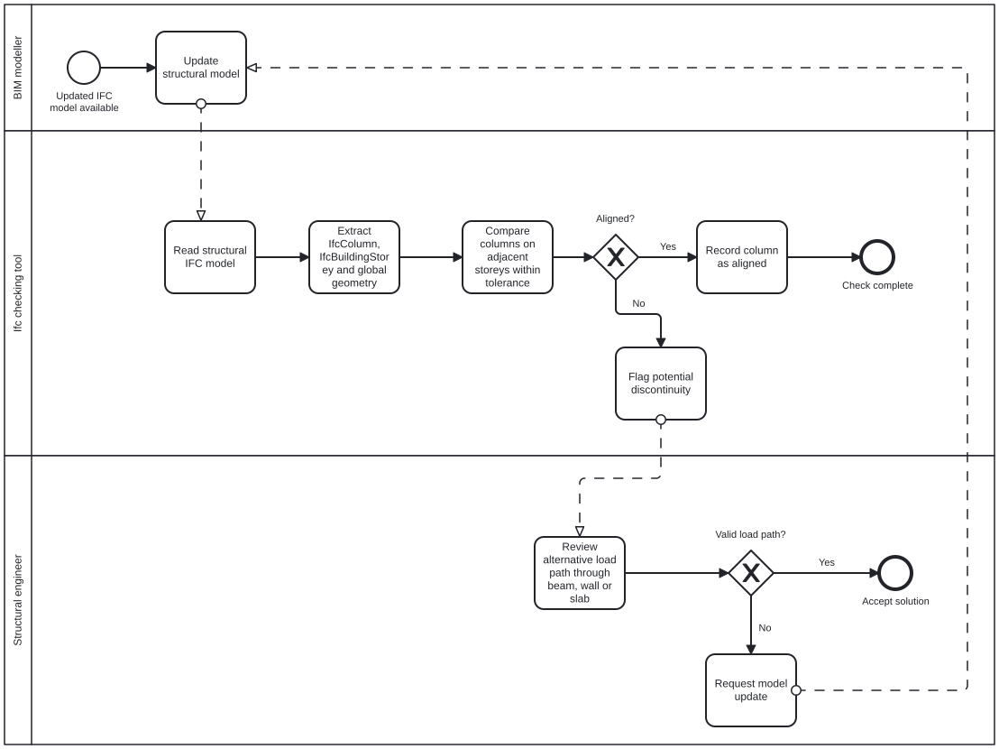

## A2a – About our group

**Python coding level:** 6  
Both group members rated their confidence in coding Python as 3 – Agree.

**Focus area:** Structures  
**Role:** Analyst

## A2b - Identify claim

**Selected report:** Structural Report #2606  
**Selected building:** Building 308  
**Focus area:** Structures

**Claim from Structural Report #2606:**  
In the Structural Report for the transformation of Building 308, Section 2.1, *Vertical*, page 2, the following statement is made:

> “The new columns are positioned to align with existing load-bearing elements where possible, allowing additional loads to be transferred through the existing concrete structure down to the basement and foundation level.”

**Description of the claim:**  
Based on the statement in Structural Report #2606, we want to investigate whether the new columns in the IFC model of Building 308 are vertically aligned with columns on the storey below. Columns that do not overlap with a column below will be identified and flagged as potential discontinuities in the vertical load path.

A column that is not vertically aligned is not necessarily a structural error. The load may instead be transferred through a beam, wall or slab. The flagged areas must therefore be assessed further by a structural engineer.

**Justification for selecting the claim:**  
A clear vertical load path is important for transferring loads through the structure to the foundations. Misaligned columns may introduce concentrated forces or require additional transfer structures. Identifying these locations manually can be time-consuming, particularly in a large structural model.

The claim from Structural Report #2606 is suitable for an OpenBIM-based check because the IFC model can provide information about the columns, their storeys, positions and geometry. An automated check can help identify areas in Building 308 that require closer examination during the design and coordination process.

## A2c – Use Case

### How would we check this claim?
The IFC model is checked to determine whether structural columns are vertically continuous between adjacent storeys. Columns on each storey are identified and their horizontal positions are compared with structural columns on the storey below.

If a column does not align with a column below, it is flagged as a potential discontinuity for further structural review. A discontinuity does not necessarily represent an error, as the load may be transferred through another structural element such as a beam or wall.

### When would this claim need to be checked?
The check should be performed during the design process and repeated when significant changes are made to the structural model.

### What information does this claim rely on?
The check relies on information contained in the IFC model, including:

- Structural columns (IfcColumn)
- Building storeys (IfcBuildingStorey)
- Column geometry and location
- Column GlobalId
- Relationship between elements and storeys

### Phase
**Design**

### BIM purpose
**Analyse**

The BIM model is analysed to identify possible discontinuities in the vertical
structural system.

### BIM Use Case
**Design review / model checking**

The use case is closest to model checking because information in the BIM model
is systematically analysed to identify conditions that require further review.

### BPMN diagram

