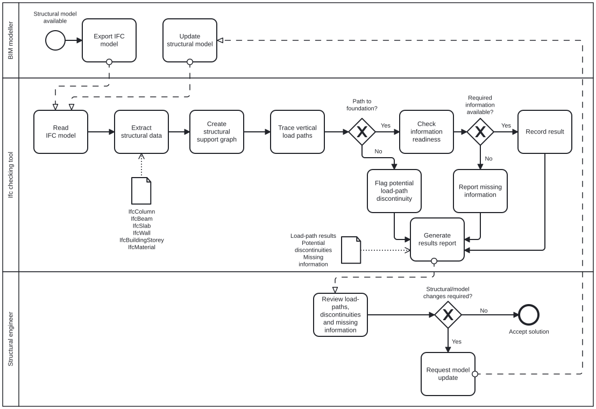
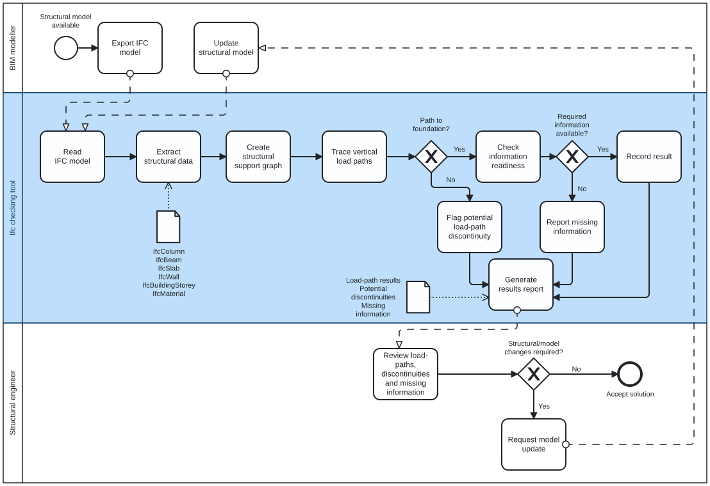

## A2a – About our group

**Python coding level:** 6  
Both group members rated their confidence in coding Python as 3 – Agree.

**Focus area:** Structures  
**Role:** Analyst

## A2b – Identify Claim

**Selected report:** 26-06-D-STR-Anon.pdf   
**Selected building:** Building 308 

### Claim

In Section 2.1, *Vertical*, on page 2 of Structural Report #2606, it is stated that the new columns are positioned to align with existing load-bearing elements, allowing loads to be transferred through the existing structure towards the foundation.

Based on this statement, the selected claim is:

> **The new structural system is intended to provide a continuous vertical load path through the new and existing load-bearing elements towards the foundation.**

### Motivation

We will investigate whether a continuous potential geometric load path can be identified through slabs, beams, columns and walls on successive storeys in the IFC model.

If a continuous path cannot be identified, the location will be flagged for further structural review. The check does not verify structural capacity, but identifies possible discontinuities and missing information in the model.

This claim was selected because Building 308 combines a new timber structure with an existing concrete structure, making the load transfer between new and existing elements particularly important.   

## A2c – Use Case

### How would we check this claim?

The IFC model is analysed to identify possible vertical load paths through the structural system. Relevant structural elements, such as slabs, beams, columns and walls, are identified and their spatial relationships are analysed.

These relationships can be represented as a structural graph, where structural elements are nodes and potential support relationships are connections. The graph can then be used to investigate the question:

> **Is there an uninterrupted structural support chain from this element to the foundation?**

If no continuous support chain can be identified, the element is flagged as a potential discontinuity for further review by a structural engineer.

In addition, the available information for the elements in the load path is checked to determine whether the model contains the information required for a subsequent structural capacity assessment. This includes geometry, dimensions, material, cross-section and load information.

The use case does not perform a structural capacity calculation.

### When would this claim need to be checked?

The check should be performed during the structural design and coordination process and repeated when significant changes are made to the structural model.

It can be particularly useful when new structural elements interact with an existing structure, as changes in element position or geometry may affect the intended vertical load path.

### What information does this claim rely on?

The check relies primarily on information contained in the IFC model,
including:

- Structural elements such as slabs, beams, columns and walls
- Building storeys
- Element geometry and position
- Spatial relationships between structural elements
- Element GlobalId
- Material information
- Cross-section and dimensions
- Load information, if available
- Foundation elements, if represented in the IFC model

### Phase

**Design**

### BIM purpose

**Analyse**

The BIM model is analysed to identify potential vertical load paths,
discontinuities and the availability of information required for further
structural analysis.

### BIM Use Case

**Design review / model checking**

The use case systematically analyses the structural IFC model to identify
possible load paths and conditions requiring further engineering review. It
also evaluates whether the model contains sufficient structural information
for a subsequent capacity assessment.

### BPMN diagram

## A2e – Tool idea

### IFC Load Path Checker

The proposed tool is a Python-based OpenBIM tool developed with IfcOpenShell. Its purpose is to identify potential vertical load paths in a structural IFC model and highlight elements that may require further review by a structural engineer.

The tool uses a structural IFC model as input and extracts relevant elements, including:

- `IfcSlab`
- `IfcBeam`
- `IfcColumn`
- `IfcWall`
- `IfcFooting`
- `IfcBuildingStorey`

The geometry, placement, dimensions, material information and `GlobalId` of the elements are extracted. Geometric relationships and a defined tolerance are then used to identify potential support relationships between the elements.

The support relationships are represented as a directed graph. The tool traces potential load paths downwards through slabs, beams, columns and walls. A path is considered complete if it reaches an `IfcFooting`. If foundations are not included in the structural IFC model, the path is traced to the lowest modelled structural level.

Elements without a continuous potential load path are flagged as possible load-path discontinuities. The tool also checks whether information required for a later structural capacity assessment is available, such as element dimensions, materials, cross-sections and loads.

The results report includes:

- Element type and `GlobalId`
- Associated building storey
- Potential supporting elements
- Load-path status
- Identified discontinuities
- Missing structural information

The tool performs a geometric and information-based model check. It does not calculate structural capacity or verify that a load path is structurally sufficient. The final assessment must therefore be performed by a structural engineer.

### Business value

The tool can reduce the time required for manual review of structural IFC models. Potential discontinuities and missing information can be identified earlier in the design process, reducing the risk of late design changes, coordination problems and additional costs.

Because the tool uses IFC and IfcOpenShell, it is independent of specific modelling software and can be reused in different OpenBIM projects. The results are traceable through the `GlobalId` of each element, which can improve communication between BIM modellers and structural engineers.

### Societal value

Earlier identification of possible discontinuities can support improved structural quality and safety. The tool does not replace engineering calculations, but it helps structural engineers identify areas requiring additional attention.

Detecting modelling problems early may also reduce unnecessary redesign, construction rework and material waste. This is particularly relevant for renovation projects such as Building 308, where new structural elements must interact with an existing structural system.

### BPMN diagram

The BPMN diagram below presents the internal workflow of the proposed Python/IfcOpenShell tool.

